# Fonts

This page contains a list of all supported fonts when not in LaTeX mode and a few examples of fonts in LaTex mode.
For a simple list of reasonable fonts in non-latex mode see [here](/man/styling/).

```@contents
Pages = ["fonts.md"]
```

## Non-LaTeX mode

The list below shows what these fonts look like and whether SVG output is
supported.

| ID       | Aliases | Looks like | SVG/Cairo   |
| :------: | :-----: | :--------: | :---: |
| rm       | roman   |                          |   ✘   |
| rmb      | roman bold |                      |   ✘   |
| rmi      | roman italic |                    |   ✘   |
| ss       | sans serif |                       |   ✘   |
| ssb      | sans serif bold |                 |   ✘   |
| ssi      | sans serif italic | 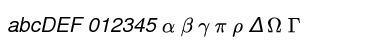              |   ✘   |
| tt       | typewriter |                       |   ✘   |
| ttb      | typewriter bold | 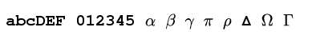                |   ✘   |
| ttbi      | typewriter bold italic | 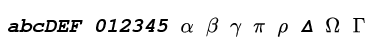                |   ✘   |
| tti      | sans serif | 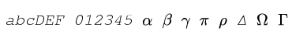                     |   ✘   |
| texcmr   | computer modern roman | 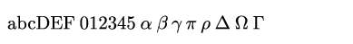       |   ✔   |
| texcmb   | computer modern bold |                      |   ✔   |
| texcmti  | computer modern text italic | 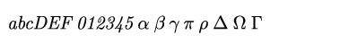             |   ✔   |
| texcmmi  | computer modern maths italic |             |   ✔   |
| texcmss  | computer modern sans serif |               |   ✔   |
| texcmssb | computer modern sans serif bold |         |   ✔   |
| texcmssi | computer modern sans serif italic | 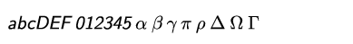      |   ✔   |
| texcmtt  | computer modern typewriter |               |   ✔   |
| texcmitt | computer modern italic typewriter | 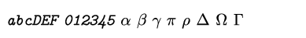      |   ✔   |
| texmi |  |       |   ✔   |
| plsr |  | 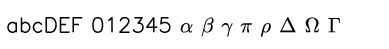      |   ✔   |
| pldr |  |       |   ✔   |
| pltr |  | 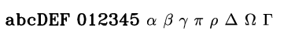      |   ✔   |
| plti |  | 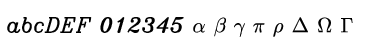      |   ✔   |
| plcr |  | 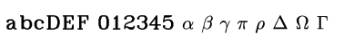      |   ✔   |
| plci |  | 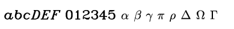      |   ✔   |
| plss |  | 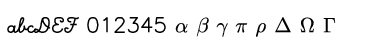      |   ✔   |
| plcs |  |       |   ✔   |
| plsa |  |       |   ✔   |
| plba |  |       |   ✔   |
| plge |  |       |   ✔   |
| plgg |  | 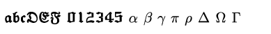      |   ✔   |
| plgi |  | 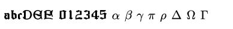      |   ✔   |
| pstr | times roman  | 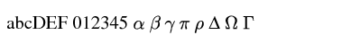      |  ✘   |
| pstb | times bold  |       |  ✘   |
| psti | times italic  |       |  ✘   |
| pstbi | times bold italic  | 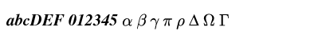      |  ✘   |
| psc | courier  | 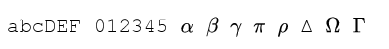      |  ✘   |
| pscb | courier bold |       |  ✘   |
| psco | courier oblique |       |  ✘   |
| pscbo | courier bold oblique  |       |  ✘   |
| psh | helvetica  |       |  ✘   |
| pshb | helvetica bold  |       |  ✘   |
| psho | helvetica oblique  |       |  ✘   |
| pshbo | helvetica bold oblique |       |  ✘   |
| pshc |   | 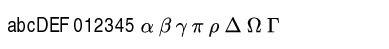      |  ✘   |
| pshcb |   |       |  ✘   |
| pshcbo |   |       |  ✘   |
| pshcdo |   | 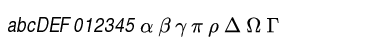      |  ✘   |
| pshn | helvetica narrow  |       |  ✘   |
| pshnb | helvetica narrow bold   |       |  ✘   |
| pshno | helvetica narrow oblique   | 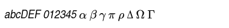      |  ✘   |
| pshnbo | helvetica narrow oblique bold   |       |  ✘   |
| psagb | avantgarde book   |       |  ✘   |
| psagd | avantgardedemi   |       |  ✘   |
| psagd | avantgardedemi   |       |  ✘   |
| psagbo | avantgardebook oblique   |       |  ✘   |
| psagdo | avantgardedemi oblique   |       |  ✘   |
| psbl | bookman light | 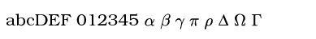      |  ✘   |
| psbd | b. demi |       |  ✘   |
| psbli | b. light italic | 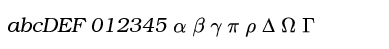      |  ✘   |
| psbdi | b. demi italic |       |  ✘   |
| psncsr | newcentury roman |       |  ✘   |
| psncsb | newcentury bold | 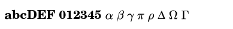      |  ✘   |
| psncsi | newcentury italic | 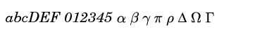      |  ✘   |
| psncsbi | newcentury bold italic |       |  ✘   |
| pspr | palatino roman | 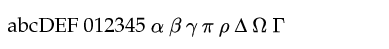      |  ✘   |
| pspb | palatino bold | 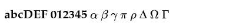      |  ✘   |
| pspi | palatino italic | 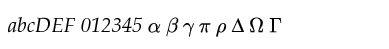      |  ✘   |
| pspbi | palatino. bold italic | 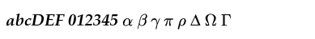      |  ✘   |
| pszcmi | zapfchancery medium italic | 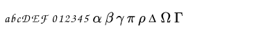      |  ✘   |
| arial8 | arial  | 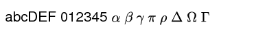      |  ✘   |
| arial8b | arial bold |       |  ✘   |
| arial8bi | arial bold italic  |       |  ✘   |
| arial8i | arial italic | 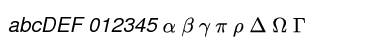      |  ✘   |
| cour8 | courier  | 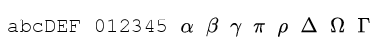      |  ✘   |
| cour8b | courier bold | 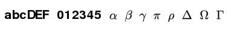      |  ✘   |
| cour8bi | courier bold italic  | 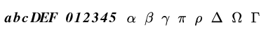      |  ✘   |
| cour8i | courier italic | 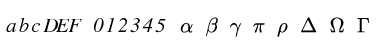      |  ✘   |
| times8 | times  | 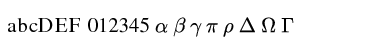      |  ✘   |
| times8b | times bold |       |  ✘   |


**Symbol fonts**

| ID       | Aliases | Looks like | SVG   |
| :------: | :-----: | :--------: | :---: |
| pssym |  | 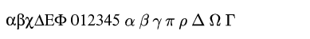      |  ✘   |
| plcg | (greek) | 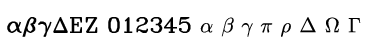      |  ✘   |
| plsg | (greek) | 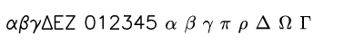      |   ✘   |
| plcc | (cyrillic) | 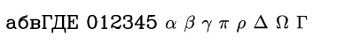      |  ✘   |
| pszd | zapfchancery demi | 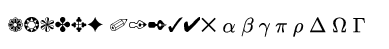      |  ✘   |


## LaTeX mode
