# Line and Scatter plots

## Basic syntax

The relevant commands here are

- `plot` and `plot!` (2D lines connecting points, no markers by default)
- `scatter`, `scatter!` (markers showing a set of points, no line by default)

The general syntax is:

```julia
command(data_to_plot...; options...)
```

a command *with* an exclamation mark will add the corresponding plot to the current active axes while a command *without* will erase any existing plot on the current active axes and then display the plot.

For instance:

@@CODE:ls_ex1

overlays a scatterplot to a line plot:

@@IMG:ls_ex1

## Data formats

The table below summarises the different ways you can specify what data to plot, they are discussed in more details and with examples further on.

| Form     | Example | Comment   |
| :------: | :-----: | :--------: |
| single vector $x$ | `plot(randn(5))` | pairs $(i, x_i)$ |
| two vectors $x,y$ | `plot(randn(5),randn(5))` | pairs $(x_i,y_i)$ |
| multiple vectors $x,y,z$ | `plot(randn(5),randn(5),randn(5))` | pairs $(x_i,y_i)$, $(x_i,z_i)$, ... |
| single matrix $X$ | `plot(randn(5,2))` | pairs $(i, x_{i1})$, $(i, x_{i2})$, ... |
| one vector then vectors or matrices | `plot(1:5, randn(5,2), randn(5))` | pairs between the first vector and subsequent columns |
| function $f$ from to | `plot(sin, 0, pi)` | draws points $x_i$ on the interval and plots pairs $(x_i, f(x_i))$ |

* **Single vector** $x$: the plot will correspond to the pairs $(i, x_i)$.

For instance:

@@CODEIMG:ls_ex2

* **Two vectors** $x$, $y$: the plot will correspond to the pairs $(x_i, y_i)$ (see e.g. the example earlier)

* **Multiple vectors** $x$, $y$, $z$: this will create multiple plots corresponding to the pairs $(x_i, y_i)$, $(x_i, z_i)$ etc.

For instance:

@@CODEIMG:ls_ex3

* **Single matrix** $X$: the plots will correspond to the pairs $(i, X_{i1})$, $(i, X_{i2})$ etc.

For instance:

@@CODEIMG:ls_ex4

* **vector and matrices or vector** $x$, $Y$, $Z$: will form plots corresponding to the pairs of $x$ and each column in $Y$, $Z$ etc.

For instance:

@@CODEIMG:ls_ex5

* **function**: will draw points on the specified range and draw $(x_i, f(x_i))$.

For instance:

@@CODEIMG:ls_ex5b

## Styling options

Line and scatter plots have effectively two things they can get styled:

1. the line styles
2. the marker styles

Note the plural, so that if you are plotting multiple lines at once, each keyword accepts a vector of elements to style the individual plots.
If a styling option is specified with a single value but multiple lines are being plotted, all will have that same value for the relevant option.

For instance:

@@CODEIMG:ls_ex6

!!! note

    GPlot typically accepts multiple aliases for option names, pick whichever one you like, that sticks best to mind or that you find the most readable.

### Line style options

For each of these options, it should be understood that you can either pass a single value or a vector of values (see the note at the beginning of the section).

- **line style** [`ls` , `lstyle`, `linestyle`, `lstyles` or `linestyles`]: takes a string describing how the line(s) will look like. For instance:

| Value    | Result  |
| :------: | :-----: |
| `"-"`      |   |
| `"--"`     | 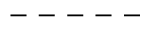 |
| `"-."`     |  |
| `"none"`   |         |


- **line width** [`lw`, `lwidth`, `linewidth`, `lwidths` or `linewidths`]: takes a positive number describing how thick the line should be in centimeters. The value `0` is the default value and corresponds to a thickness of `0.02`.

| Value    | Result  |
| :------: | :-----: |
| `0.001`      |         |
| `0.01`     |   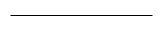      |
| `0.05`     |         |
| `0.1 `    |    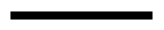     |
| `0 `  |         |

- **line colour** [`lc`, `col`, `color`, `cols` or `colors`]: takes a string (most [SVG color name](https://www.december.com/html/spec/colorsvg.html)) or a `Color` object (from the [`Colors.jl`](https://github.com/JuliaGraphics/Colors.jl) package) describing how the line should be coloured.

| Value    | Result  
| :------: | :-----:
| `"cornflowerblue"` | 
| `"forestgreen"` | 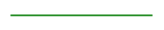
| `"indigo"` | 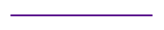
| `"RGB(0.5,0.7,0.2)"`   |        

Note that if the colour is not specified, a default colour will be taken by cycling through a colour palette.

- **smoothness** [`smooth` or `smooths`]: takes a boolean indicating whether the line interpolating between the points should be made out of straight lines (default, `smooth=false`) or out of interpolating splines (`smooth=true`). The latter may look nicer for plots that represent a continuous function when there aren't many sampling points (if there are many sampling points, typically more than 50, you usually won't see the difference and can omit this keyword).

@@CODEIMG:ls_ex7

Here's another example combining several options:

@@CODEIMG:ls_ex8


### Marker style options

* **marker** [`marker` or `markers`]: takes a string describing how the marker should look. Most markers have aliases. Note also that some shapes have an "empty" version and a "filled" version (the name of the latter being preceded by a `f`). For instance:

| Value    | Result  |
| :------: | :-----: |
| `"o"` or `"circle"`       | 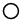 |
| `"." or "fo" or "fcircle"`| 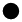 |
| `"^"` or `"triangle"`     | 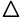 |
| `"f^"` or `"ftriangle"`   | 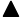 |
| `"s"` or `"square"`       | 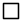 |
| `"fs"` or `"fsquare"`     |  |
| `"x"` or `"cross"`        | 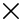 |
| `"+"` or `"plus"`         | 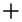 |

* **marker size** [`ms`, `msize`, `markersize`, `msizes` or `markersizes`]: takes a number indicative of the character height in centimeter.

| Value    | Result  |
| :------: | :-----: |
| `0.1` | 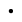 |
| `0.25`| 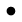 |
| `0.5` | 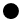 |

* **marker colour** [`mc`, `mcol`, `markercol`, `markercolor`, `mcols`, `markercols` or `markercolors`]: describes the marker colour see line colour.

## Notes

### Missing, Inf or NaN values

If the data being plotted contains `missing` or `Inf` or `NaN`, these values will all be treated the same way: they will not be displayed.

@@CODEIMG:ls_ex9

### Modifying the underlying data

Plotting objects are tied to the data meaning that if you modify a vector that is currently plotted *in place* and refresh the plot, the plot will change accordingly.

@@CODEIMG:ls_ex10

This _only_ happens for in-place modification; note the difference with the example below:

@@CODEIMG:ls_ex11
