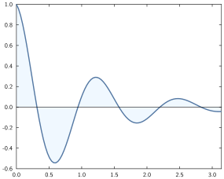
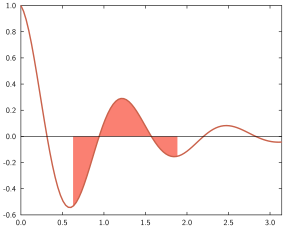
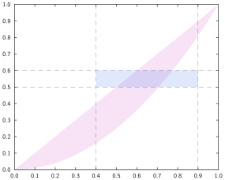

# Fill between lines


## Syntax

The relevant commands here are

- `fill_between` and `fill_between!`,

and the syntax is:

```julia
command(x, y1, y2; options...)
```

where

* `x` must be a vector of values or a range of values,
* `y1` and `y2` can either be a real value (horizontal line) or a vector of values of length matching `x`.

For instance:


```julia
x = range(0, stop=π, length=100)
y1 = 0
y2 = @. cos(5x)*exp(-x)
plot(x, y2, lw=0.05)
fill_between!(x, y1, y2, fill="aliceblue")
hline(y1)
xlim(0, π)
```




## Styling options

* **from/to** [`from`, `min`, `xmin` // `to`, `max`, `xmax`]: takes a number indicating one or both vertical limits for the fill.


```julia
x = range(0, stop=π, length=100)
y1 = 0
y2 = @. cos(5x)*exp(-x)
plot(x, y2, lw=0.05)
fill_between!(x, y1, y2, fill="salmon", from=π/5, to=3π/5)
hline(y1)
xlim(0, π)
```




* **fill colour** [`col`, `color`, `fill`]: takes a colour to use for the filling (see examples above).

* **alpha** [`alpha`]: when considering a transparent-capable output format, this takes a number between 0 and 1 indicating the level of transparency (towards 0 is more transparent, towards 1 more opaque).


```julia
x = range(0, stop=1, length=100)
y = x.^2
fill_between(x, y, x; color="orchid", alpha=0.2)
fill_between!(x, 0.5, 0.6; from=0.4, to=0.9, alpha=0.2)
style = (color="darkslategray", ls="--", lw=0.01)
hline(0.5; style...)
hline(0.6; style...)
vline(0.4; style...)
vline(0.9; style...)
```



