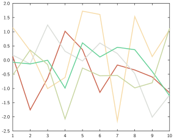

# Global settings

GPlot has a number of global parameters that you can change and that will affect all actions in the current session; those are contained in the `GPlot.GP_ENV` dictionary.

The most important ones are `PALETTE` and `CONT_PREVIEW`.

## Palette

The palette is a vector of colours that are used by default if no colours are specified in a plot; the default one is inspired by Tableau's 10-2 palette:

```@raw html
<svg style="display: block; margin: auto auto;" width="40em" heigth="5em">
	<circle cx="2em" cy="2em" r="1em" fill="#5478A3" />
	<circle cx="6em" cy="2em" r="1em" fill="#E69142" />
	<circle cx="10em" cy="2em" r="1em" fill="#D15E5C" />
	<circle cx="14em" cy="2em" r="1em" fill="#82B2B0" />
	<circle cx="18em" cy="2em" r="1em" fill="#6B9E59" />
	<circle cx="22em" cy="2em" r="1em" fill="#E8C95E" />
	<circle cx="26em" cy="2em" r="1em" fill="#A87D9E" />
	<circle cx="30em" cy="2em" r="1em" fill="#F2A1A8" />
	<circle cx="34em" cy="2em" r="1em" fill="#967561" />
	<circle cx="38em" cy="2em" r="1em" fill="#B8B0AB" />
</svg>
```

To specify a palette, use [`set_palette`](@ref) with your specified `Vector{<:Color}`.
For instance:


```julia
using Colors
set_palette([c"#ca624b", c"#f7dba7", c"#daddd8", c"#61d095", c"#c7d59f"])
for i in 1:5
    plot!(randn(10), lw=0.05)
end
```




## Continuous preview

This parameter is useful if you are using GPlot with Juno.
By default, GPlot will try to display things in the plot pane whenever you execute a line such as `plot(...)`.
In some cases, you may want to avoid this and, instead, only show things when _you_ want it.

For this, just use [`continuous_preview`](@ref) to toggle it on or off; for instance:

```julia
continuous_preview(false)
```

subsequently, no plots will be displayed automatically, you will have to explicitly use `preview(fig)` or `preview()` to preview a specified figure or the current figure.
