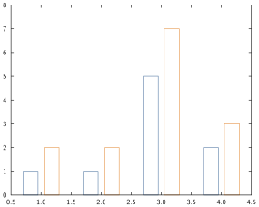

# Histograms and bar plots

This page assumes you're already roughly familiar with how things roll as per [lines and scatters](../../line-scatter/).

## Basic syntax

The relevant commands here are

- `hist` and `hist!` (for histograms),
- `bar` and `bar!` (for barplots).

## Data formats

For **bars**, the situation is pretty much identical as for line and scatter plots ([see here](../../line-scatter/#Data-formats-1)) with the exception that it doesn't accept a function.
For instance:


```julia
data = [1 2; 1 2; 5 7; 2 3]
bar(data)
```




For **histograms**, the syntax is always `hist(x; opts...)` where `x` is a vector (for now histograms can only be drawn one at the time).
For instance:


```julia
data = exp.(randn(200)/5)
hist(data; nbins=20)
```


!!! note

    If you would like to be able to draw multiple histograms in one shot, please open a feature request explaining your use case. It shouldn't be hard to implement.

## Styling options

### General histogram options

* **horizontal** [`horiz` or `horizontal`]: takes a boolean indicating the orientation of the histogram.


```julia
data = randn(100)
hist(data; horiz=true)
```


* **number of bins** [`bins` or `nbins`]: takes a positive integer indicating the number of bins that should be used (default uses [Sturges' formula](https://en.wikipedia.org/wiki/Histogram#Sturges'_formula)).

* **scaling** [`scaling`]: takes a string describing how the bins should be scaled.

| Value    | Comment  |
| :------: | :-----: |
| `"none"` or `"count"` | number of entries in a range |
| `"pdf"`     | area covered by the bins equals one |
| `"prob"` or `"probability"`     |
| `"none"`   |  count divided by the overall number of entries  |

If you want to adjust a pdf plot on top of a histogram, `pdf` is usually the scaling you will want to use.
For instance:


```julia
x = randn(500)
hist(x; nbins=50, scaling="pdf")
plot!(x -> exp(-x^2/2)/sqrt(2π), -3, 3)
```


### General bar options

* **horizontal** [`horiz` or `horizontal`]: same as for histograms.
* **stacked** [`stacked`]: takes a boolean indicating whether to stack the bars (`true`) or put them side by side (`false`) when drawing multiple bars. Note that when stacking bars, it is expected that subsequent bars are increasing (so for instance `7,8,10` and not `7,5,10`).


```julia
# percentages
data = [30 40 30; 50 25 25; 30 30 40; 10 50 40]
# cumulative sum so that columns increase
data_cs = copy(data);
data_cs[:,2] = data_cs[:,1]+data_cs[:,2]
data_cs[:,3] .= 100
bar(data_cs; stacked=true, fills=["midnightblue", "lightseagreen", "lightsalmon"])
```


* **bar width** [`width`, `bwidth` or `barwidth`]: takes a positive number indicating the width of all bars.


```julia
data = [10, 50, 30]
bar(data; width=1, fill="hotpink")
```


### Bar style options

Both histograms and bars share styling options for the style of the bars (essentially: their edge and fill colour).
Note that since bars can be drawn in groups, each option can take a vector of values corresponding to the number of bars drawn.
If a single value is passed, all bars will share that option value.

* **edge colour** [`ecol`, `edgecol`, `edgecolor`, `ecols`, `edgecols` or `edgecolors`]: takes a colour for the edge of the bars. If it's specified but not the fill, then the fill is set to white.


```julia
hist(randn(100); col="powderblue")
```


* **fill colour** [`col`, `color`, `cols`, `colors`, `fill` or `fills`]: takes a colour for the filling of the bars. If it's specified but not the edge colour, then the edge colour is set to white.


```julia
hist(randn(100); ecol="red", fill="wheat")
```


## Notes

### Missing, Inf or NaN values

* For histograms, only `missing` values are allowed, attempting to plot a histogram with `Inf` or `NaN` will throw an error, if you still want to do it, you should pre-filter your array.
* For bars, the same rule as for `plot` apply, these values will be ignored (meaning that some bar will not show).

### Modifying the underlying data

The same comment as the one made in [line and scatter plots](http://localhost:8080/man/line-scatter/#Modifying-the-underlying-data-1) holds.
