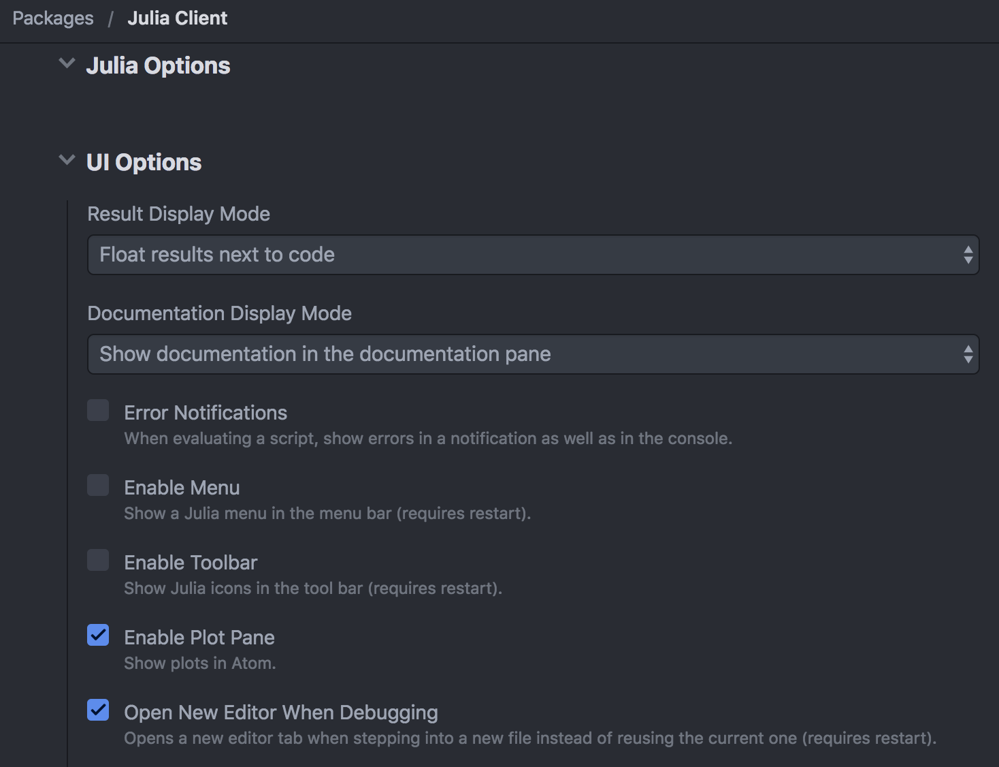

# Installation

To work with GPlot, you will need three things:

1. Julia ≥ 1.0,
1. the GPlot.jl package,
1. the GLE engine.

**Note**: if you intend to use LaTeX, you will also need to have `pdflatex`.

To install GPlot in Julia, the usual command for unregistered packages applies:

```julia-repl
] add https://github.com/tlienart/GPlot.jl
```

To get GLE working, please follow the instructions further below depending on your OS.
After following the instructions, check in Julia that the following command works:

```julia-repl
julia> run(`gle -v`)
GLE version 4.2.4c
Usage: gle [options] filename.gle
More information: gle -help
Process(`gle -v`, ProcessExited(0))
```

!!! note

    If you encounter problems with the instructions below or believe that the instructions could be simplified, please [open an issue](https://github.com/isaacs/github/issues/new?title=[foo]&body=*please%20indicate%20your%20OS%20and%20steps%20followed...*). Also if you managed to follow the instructions successfully with an OS that's not explicitly in the list below, please let me know and I can add it here.

### Juno and IJulia setup

You don't have to use either Juno or IJulia to use GPlot but, if you do, you will be able to see previews of the plots you're generating.
These previews are lossy PNGs to increase the speed at which they can be displayed, you should keep that in mind if you see pixel-imperfections in the way curves or fonts are displayed.

In Juno, you should make sure that the option _Enable Plot Pane_ is ticked in the _UI Options_ part of the julia-client settings [`Packages -> Julia -> Settings`].



## GLE on Linux

**Tested**

* Ubuntu: `sudo apt-get install gle-graphics`

**Untested**

* Fedora, CentOS though `yum install gle` should "just work"
* Other distros.

See also [the official GLE website](http://glx.sourceforge.net/downloads/downloads.html).

## GLE on MacOS

(*There may be a simpler approach but I'm sure this one works and is straightforward.*)

* **Tested**: Mojave, High Sierra.
* **Untested**: Older versions.

The original instructions to install GLE ([available here](http://glx.sourceforge.net/tut/mac.html)) are reproduced below for convenience:

1. Get the Ghostscript dmg [from sourceforge](http://prdownloads.sourceforge.net/glx/Ghostscript-8.63.dmg?download) and copy-paste its content (`Ghostscript.framework`) in `/Library/Frameworks/` (*do that even if you already have ghostscript on your machine*)
1. Get the **QGLE** dmg [from sourceforge](http://prdownloads.sourceforge.net/glx/gle-graphics-4.2.4c-exe-mac.dmg?download) and put its content in your `/Applications/` folder.

Check that the following now works in your terminal:

```bash
$> /Applications/QGLE.app/Contents/bin/gle -v
GLE version 4.2.4c
Usage: gle [options] filename.gle
More information: gle -help
```

The only thing left to do is to copy the right files to `/usr/local/` so that `gle` can be called from Julia easily.
When running the following few lines you may get a message saying that the link to `libpng` already exists, that's fine.

```bash
ln -s /Applications/QGLE.app/Contents/bin/gle /usr/local/bin/.
ln -s /Applications/QGLE.app/Contents/bin/glegs /usr/local/bin/.
ln -s /Applications/QGLE.app/Contents/lib/libgle-graphics-4.2.4c.dylib /usr/local/lib/.
ln -s /Applications/QGLE.app/Contents/lib/libpng.dylib /usr/local/lib/.
ln -s /Applications/QGLE.app/Contents/share/gle-graphics/ /usr/local/share/.
```

**Note**: you can also copy the files directly using `cp` instead of `ln -s` in the lines above and then remove `QGLE.app` from your computer as GPlot does not need it.

## GLE on Windows

I haven't tested GLEs on Windows but there are executables available on the [GLE downloads page](http://glx.sourceforge.net/downloads/downloads.html) which should-just-work™ (one has been updated recently).

_If you've managed to make things work for you on Windows, please let me know so that I can improve these instructions!_
