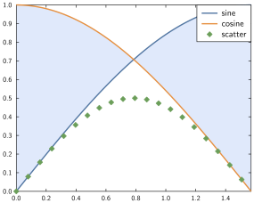

# Legend


## Syntax

The relevant command here is

- `legend`

with the general syntax being:

```julia
legend(objects; options...)
```

At the moment, a legend can be added for

- Line and scatter plots
- Bar plots and histograms
- Fill plots

### Automatic

The drawings that can have a legend all accept a keyword indicating the legend entry/entries.
Subsequent call to `legend(; options...)` will build the legend based on these.
For groups of drawings, the keyword can take a vector of strings indicating the legend entries.


```julia
x = range(0, stop=1, length=20)
plot(x, x.^2, x.^3, lw=0.05, ls=["--", "-"], marker=["wo", "none"],
     keys=["quadratic", "cubic"],)
scatter!(x, sin.(x), key=["sine"])
legend(; position="top-left")
```


| Keyword     | Valid for | Example   |
| :------: | :-----: | :--------: |
| `key`, `label` | `plot`, `scatter`, `plot3`, `scatter3`, `bar`, `hist`, `fill_between` | `plot(sin, 0, π, label="sine")` |
| `keys`, `labels` | `plot`, `scatter`, `bar` | `plot(x, y, z, labels=["func 1", "func 2"])` |

!!! note

    For `plot`, `scatter` and `bar`, it doesn't matter whether you use the plural keyword or the singular, the same function is used in the background. It may just be more readable to use the plural if you are labelling several objects in one shot.

Two special cases may be useful:

* if no label(s) are passed but `legend` is called, default legend entries will be used for all elements,
* if only some label(s) are passed, only those will appear in the legend.

Consider the two examples below:


```julia
plot(exp, 0, 1)
plot!(sqrt, 0, 1)
legend()
```


```julia
plot(exp, 0, 1)
plot!(sqrt, 0, 1, label="sqrt")
legend()
```


### Element by element

Another approach is to collect the handles of what you have drawn and pass the vector of handles to legend along with a matching vector of strings.


```julia
x = range(0, stop=π/2, length=100)
d1 = plot(x, sin.(x), lw=0.05)
d2 = plot!(x, cos.(x), lw=0.05)
fill_between!(x, sin.(x), cos.(x), alpha=0.2)
x = x[1:5:end]
d3 = scatter!(x, sin.(x) .* cos.(x), msize=0.3, marker="fdiamond")
legend([d1, d2, d3], ["sine", "cosine", "scatter"])
xlim(0,π/2)
```




!!! warning

    If you combine `bar`, `hist` or `fill_between` legend entries with `scatter` legend entries,
    it may be happen that descriptive symbols are misaligned in the legend.
    If that's the case for you, please open an issue with a reproducing example.
    This is a GLE bug and a GPlot workaround may be provided in the future.

## Styling options

!!! wip

    wip as of 22/03/2019

### Aspect

* off/on
* bgcol
* nobox/box
* bgalpha

### Positioning

* position/pos
* margins, offset

### Text styling

* see styling
