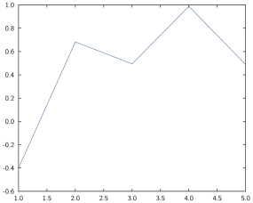
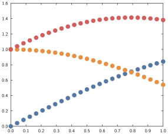

# Line and scatter plot

## Basic syntax

The relevant commands here are `plot`, `plot!`, `scatter` and `scatter!`.
The key command is a `plot` which is just a 2D line connecting a set of points; where `plot` by default shows a line and no marker, `scatter` by default shows markers and no line.

The general syntax is:

```
command(data_to_plot...; options...)
```

a command *with* an exclamation mark will add the corresponding plot to the current active axes while a command *without* will erase any existing plot on the current active axes and then display the plot.

For instance:


```julia
x = range(-2.5, stop=2.5, length=100)
y = @. exp(-x^2) * sin(x)
plot(x, y)
mask = 1:5:100
scatter!(x[mask], y[mask])
```


overlays a scatterplot to a line plot:


## Data formats

These commands take vectors or matrices of points, as long as the number of rows match you should be fine.

* **Single vector** $x$: the plot will correspond to the pairs $(i, x_i)$.

For instance:


```julia
plot(randn(5))
```





* **Two vectors** $x$, $y$: the plot will correspond to the pairs $(x_i, y_i)$ (see e.g. the example earlier)

* **Multiple vectors** $x$, $y$, $z$: this will create multiple plots corresponding to the pairs $(x_i, y_i)$, $(x_i, z_i)$ etc.

For instance:


```julia
x = range(0, 1, length=100)
plot(x, x.^2, x.^3, x.^4)
```


* **Single matrix** $X$: the plots will correspond to the pairs $(i, X_{i1})$, $(i, X_{i2})$ etc.

For instance:


```julia
plot(randn(10, 3))
```


* **vector and matrices or vector** $x$, $Y$, $Z$: will form plots corresponding to the pairs of $x$ and each column in $Y$, $Z$ etc.

For instance:


```julia
x = range(0, 1, length=25)
y = @. sin(x)
z = @. cos(x)
t = y .+ z
scatter(x, hcat(y, z), t)
```





## Styling options

Line and scatter plots have effectively two things they can get styled:

1. the line styles
2. the marker styles

Note the plural, so that if you are plotting multiple lines at once, each keyword accepts a vector of elements to style the individual plots.
Note that if a styling option is specified with a scalar but multiple lines are being plotted, all will have that same option.

For instance:


```julia
plot(randn(10, 3), colors=["violet", "navyblue", "orange"], lwidth=0.2)
```


### Line style options

- **line style** [`ls` , `lstyle`, `linestyle`, `lstyles` and `linestyles`]: take a string (or vector of strings) describing how the line(s) will look like.

- **line width** [`lw`, `lwidth`, `linewidth`, `lwidths` and `linewidths`]: takes a positive number (or vector of positive numbers) describing how thick the line should be in cm.

- **line color** [`col`, `color`, `cols` and `colors`]: take a string or a Color (from the [`Colors.jl`](https://github.com/JuliaGraphics/Colors.jl) package).

- **smoothness**:


### Marker style options

## Notes

Infinities, NaNs and Missing values are all treated the same way: they're not shown.

TBD
- plot is tied to data, if data changes, the plot will change too, so should be careful. Note that this is ONLY if the data is modified in place. So for instance

```julia
x = randn(5)
y = randn(5)
plot(x, y)
x = zeros(5)
xlabel("blah") # the graph will not have changed
```

however

```julia
x = randn(5)
y = randn(5)
plot(x, y)
x[1] = 0.0
xlabel("blah") # here the first point will be (0.0, y[1])
```

- Inf, NaN and Missings are all considered in the same way (as missings).

## Bar plot
