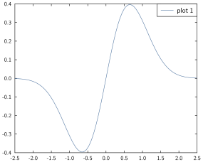

# Quickstart

Once both GLE and GPlot are successfully installed, this short tutorial should give a feeling for how things work; for more detailed instructions refer to the rest of the manual.
We will draw a simple plot with two curves, labels, and basic axis styling.

Let's start by creating a simple figure:

```julia
fig = Figure()
```

!!! note

    It is not required to explicitly call `Figure()`; if no figure currently exists, the first plotting command will generate one with default parameters.

Let's now define a function over the range `[-2.5, 2.5]` and plot it:


```julia
x = range(-2.5, stop=2.5, length=100)
y = @. exp(-x^2) * sin(x)
plot(x, y, label="plot 1")
legend()
```


where we've used the `@.` syntax to indicate that the operations are done pointwise on `x` ([broadcasting](https://docs.julialang.org/en/v1/manual/arrays/index.html#Broadcasting-1)).
The syntax should hopefully feel reasonable thus far.





Let's add another curve on this figure and change the colour; let's also specify axis limits, where the ticks have to be etc:


```julia
y2 = @. sin(x^2) * exp(-x/10)
plot!(x, y2, col="blue", lwidth=0.05, label="plot 2")

xlabel("x-axis")
ylabel("y-axis")
xticks([-pi/2, 0, pi/2], ["π/2", "0", "π/2"])
ylim(-1.5, 1.5)
yticks(-1:0.25:1)

legend()
```


One thing worth noting at this point is that we follow `Plots.jl`'s convention adding a `!` after `plot` to indicate that it should modify the current graph without overwriting it (i.e. the new curve is added on top of the existing one).


Now we can save this figure:

```julia
savefig(fig, "my_first_figure.pdf")
```

the command picks up the format (here `.pdf`) and saves the file in the current folder.

!!! comment

    If you got this far thinking that all this seems reasonable, have a look at the rest of the doc to learn how to plot what you want and how you want it 📊 , happy plotting!
